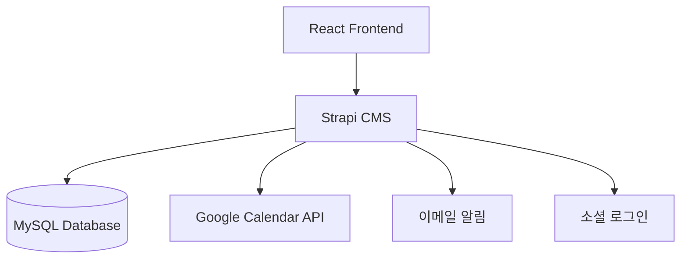

# FabLab Reservation System v1.0 by Martin

## 준비된 기초 템플릿 목록
- Backend
  - node-js : Node-js를 적용한 템플릿
- Frontend
  - React : React를 적용한 템플릿
- mobile
  - Flutter : Flutter를 적용한 템플릿

## 구현 요구사항
- 교내 FabLab 사용 사전 예약 웹 서비스
- 목적 : 교내의 FabLab 시설에 대하여 사전에 사용을 예약할 수 있는 시스템을 구축한다.(즉, 시설 예약 시스템 구축임)
- 구현 기능 목록
  - 회원가입 기능 : 수집정보(아이디, 비번, 이름, 학번, 연락처)
    - 아이디는 이메일주소로 설정
    - 비번은 최소 8자 이상 영문 대소문자, 숫자, 특수문자 조합으로 설정
    - 학번은 숫자 7자리로 설정
    - 연락처는 휴대전화 번호로 설정(010-xxxx-xxxx)
    - 회원가입 시 학번 중복 체크 기능 추가
    - 회원가입 시 연락처 중복 체크 기능 추가
    - github 로그인 기능 추가
    - google 로그인 기능 추가
    - kakao 로그인 기능 추가
    - 네이버 로그인 기능 추가
    - facebook 로그인 기능 추가
  - 로그인 기능
    - 로그인 실패 시 알림창 추가
    - 로그인 성공 시 메인 페이지로 이동
    - 3회 이상 로그인 실패 시 30초 후 로그인 제한 기능 추가
  - 로그아웃 기능
    - 로그아웃 성공 시 로그인 페이지로 이동
  - 비밀번호 변경 기능
  - 회원 탈퇴 기능
    - 회원 탈퇴 시 탈퇴 사유 입력 기능 추가
    - 회원 탈퇴 시 비밀번호 재확인 기능 추가
  - 예약 기능
    - 예약 시 예약자 정보 입력 기능 : 예약자 이름, 예약자 학번, 예약자 연락처(회원가입 정보 활용)
    - 예약 시 예약 시간 선택 기능 : 오전 9시 ~ 오후 10시 (1시간 단위)
    - 예약 시 예약 목적 선택 기능 : 팀프로젝트, 개인학습, 조별학습, 회의, 기타(기타 선택 시 예약 목적 입력 기능 추가)
  - 예약 확인 기능
    - 로그인 회원만 예약 확인 가능
    - 로그인 시 가장 먼저 다가오는 예약을 메인 페이지에 표시
  - 예약 취소 기능
    - 예약 취소 시 예약 취소 사유 입력 기능 추가
  - 예약 승인 기능
    - 관리자가 설정한 기간에는 예약 승인 기능 추가
  - 예약 거절 기능
    - 관리자가 설정한 기간에는 예약 거절 기능 추가
  - 달력 기능
    - 로그인 회원만 달력 확인 가능
    - 달력에 예약 표시
  - FabLab 관리자 페이지
    - 예약 승인 기능
    - 예약 거절 기능
    - 예약 승인 시 예약자에게 예약 승인 알림 기능 추가
    - 예약 거절 시 예약자에게 예약 거절 알림 기능 추가
    - 예약 취소 시 예약자에게 예약 취소 알림 기능 추가
    - 예약 목록 확인 기능
    - 예약 캘린더 확인 기능(관리자 구글 캘린더 연동)
    - 예약 목록 검색 기능(예약자 이름, 예약자 학번, 예약자 연락처, 예약 시간, 예약 목적)
    - 예약 목록 정렬 기능(예약 시간순, 예약자 이름순, 예약자 학번순, 예약자 연락처순)
- 주의 사항 : FabLab 좌석 형태별 예약이 가능하도록 할 것
  - 1인 연구석: 동쪽 6석, 서쪽 6석 (총 12석) : 동1, 동2, 동3, 동4, 동5, 동6, 서1, 서2, 서3, 서4, 서5, 서6
  - 창가석 : 6석 : 창가1, 창가2, 창가3, 창가4, 창가5, 창가6
  - 아이맥석 : 3석 : 아이맥1, 아이맥2, 아이맥3  
  - 팀프로젝트석(6인 테이블 8개) : 테이블1, 테이블2, 테이블3, 테이블4, 테이블5, 테이블6, 테이블7, 테이블8
    - 팀별 예약 가능, 개인별 예약 가능, 개인 또는 팀인원 최대 6인까지 예약 가능
- 예약 시 중복예약을 방지하기 위한 처리

## 디자인 요구 사항
- 디자인 컨셉 : 모던한 디자인
- 디자인 컬러 : 흰색, 버건디 레드, 건디 그레이
- 디자인 툴 : Figma
- 디자인 예시 : https://www.figma.com/community/file/1268484218873891387

## font, icon, noto
- 폰트 : Noto Sans KR
- 아이콘 : 구글 폰트아이콘(Material Symbols Outlined)
- 노토 : Noto Sans KR
- 컬러 : 흰색, 버건디 레드, 버건디 그레이
- 로고 : 목원대학교 컴퓨터공학과 로고 : https://www.youtube.com/@mw_computer
- 배너 : 목원대학교 컴퓨터공학과 배너 : https://yt3.googleusercontent.com/IUreA7CNsTb8KEENJ054xWXF7t5VTtSWk-YWpNUZLjyczRnQRd4T6t9zV3LDWCLVF9fiDDvp=w1707-fcrop64=1,00005a57ffffa5a8-k-c0xffffffff-no-nd-rj

## 참고 사이트
- 구글 폰트아이콘 : https://fonts.google.com/icons
- 구글 캘린더 API : https://developers.google.com/calendar/api/guides/concepts/calendars
- 구글 캘린더 예제 : https://github.com/googleapis/google-api-python-client/tree/main/examples/calendar_quickstart
- 구글 캘린더 라이브러리 : https://github.com/googleapis/google-api-python-client
- 구글 캘린더 라이브러 설치 : https://googleapis.dev/python/google-api-core/latest/auth.html

## 디자인 참고 사이트
- 목원대학교 홈페이지 : https://www.mokwon.ac.kr/
- 목원대학교 컴퓨터공학과 : https://www.mokwon.ac.kr/computer/

## 기술 스택
- Backend: Strapi (Headless CMS)
  - Node.js v18 이상 필요
  - MySQL 데이터베이스 사용
- Frontend: React
- 인증: Strapi 기본 인증 + OAuth 2.0
- API 문서화: Strapi 자동 생성 API 문서

## 시스템 아키텍처


## 개발 환경 설정
1. 사전 요구사항
   - Node.js v18 이상
   - MySQL v8.0 이상
   - yarn 또는 npm

2. Strapi 설치 및 실행
   ```bash
   npx create-strapi-app@latest fablab-backend
   cd fablab-backend
   yarn develop # 또는 npm run develop
   ```

3. 환경 변수 설정 (.env)
   ```
   DATABASE_HOST=localhost
   DATABASE_PORT=3306
   DATABASE_NAME=fablab
   DATABASE_USERNAME=your-username
   DATABASE_PASSWORD=your-password
   GOOGLE_CALENDAR_API_KEY=your-key
   OAUTH_GITHUB_CLIENT_ID=your-client-id
   OAUTH_GITHUB_CLIENT_SECRET=your-client-secret
   // ... 기타 OAuth 설정
   ```

4. 콘텐츠 타입 설정
   - 사용자 (Users)
   - 예약 (Reservations)
   - 좌석 (Seats)
   - 예약 목적 (Purposes)

## API 엔드포인트
Strapi에서 자동으로 생성되는 REST API 엔드포인트:
- `POST /api/auth/local/register` : 회원가입
- `POST /api/auth/local` : 로그인
- `POST /api/auth/forgot-password` : 비밀번호 찾기
- `PUT /api/auth/password-change` : 비밀번호 변경
- `DELETE /api/users/me` : 회원 탈퇴
- `GET /api/reservations` : 예약 목록 조회
- `POST /api/reservations` : 새로운 예약 생성
- `PUT /api/reservations/:id` : 예약 수정
- `DELETE /api/reservations/:id` : 예약 취소
- `GET /api/seats` : 좌석 목록 조회
- `GET /api/seats/:id/availability` : 좌석 예약 가능 여부 확인

## 프로젝트 구조
```
fablab-project/
├── frontend/                
│   ├── src/
│   │   ├── components/     
│   │   │   ├── auth/      
│   │   │   │   ├── LoginForm.jsx        # 일반 로그인 폼
│   │   │   │   ├── RegisterForm.jsx     # 회원가입 폼
│   │   │   │   ├── SocialLogin.jsx      # 소셜 로그인 버튼들
│   │   │   │   ├── PasswordChange.jsx   # 비밀번호 변경
│   │   │   │   └── WithdrawalForm.jsx   # 회원탈퇴 폼
│   │   │   ├── reservation/  
│   │   │   │   ├── ReservationForm.jsx      # 예약 입력 폼
│   │   │   │   ├── ReservationCalendar.jsx  # 예약 캘린더 뷰
│   │   │   │   ├── SeatMap.jsx             # 좌석 배치도
│   │   │   │   ├── SeatSelection.jsx       # 좌석 선택 컴포넌트
│   │   │   │   ├── ReservationList.jsx     # 예약 목록
│   │   │   │   └── ReservationDetail.jsx   # 예약 상세 정보
│   │   │   ├── admin/     # 관리자 컴포넌트
│   │   │   │   ├── AdminDashboard.jsx    # 관리자 대시보드
│   │   │   │   ├── ReservationApproval.jsx # 예약 승인/거절
│   │   │   │   ├── UserManagement.jsx    # 사용자 관리
│   │   │   │   └── Statistics.jsx        # 통계 및 보고서
│   │   │   ├── seat/                # 추가: 좌석 관련
│   │   │   │   ├── SeatGrid.jsx     # 좌석 그리드 뷰
│   │   │   │   ├── SeatType.jsx     # 좌석 유형 선택
│   │   │   │   └── TeamSeatForm.jsx # 팀 좌석 예약
│   │   │   ├── notification/        # 추가: 알림 관련
│   │   │   │   ├── EmailNotification.jsx
│   │   │   │   └── AlertModal.jsx
│   │   │   └── common/    
│   │   ├── pages/         
│   │   │   ├── Home.jsx               # 메인 페이지
│   │   │   ├── Login.jsx              # 로그인 페이지
│   │   │   ├── Register.jsx           # 회원가입 페이지
│   │   │   ├── MyPage.jsx             # 마이페이지
│   │   │   ├── Reservation/           # 예약 관련 페이지
│   │   │   │   ├── New.jsx            # 새 예약
│   │   │   │   ├── List.jsx           # 예약 목록
│   │   │   │   └── Calendar.jsx       # 캘린더 뷰
│   │   │   └── Admin/                 # 관리자 페이지
│   │   │       ├── Dashboard.jsx
│   │   │       ├── Reservations.jsx
│   │   │       └── Users.jsx
│   │   ├── hooks/         
│   │   │   ├── useAuth.js             # 인증 관련 훅
│   │   │   ├── useReservation.js      # 예약 관련 훅
│   │   │   ├── useNotification.js     # 알림 관련 훅
│   │   │   └── useCalendar.js         # 캘린더 관련 훅
│   │   ├── api/           
│   │   │   ├── client.js              # axios 설정
│   │   │   ├── auth.js                # 인증 API
│   │   │   ├── reservations.js        # 예약 API
│   │   │   └── admin.js               # 관리자 API
│   │   ├── styles/        
│   │   │   ├── global.css             # 전역 스타일
│   │   │   ├── theme.js               # 테마 설정
│   │   │   └── variables.css          # CSS 변수 (버건디 컬러 등)
│   │   └── utils/         
│   │       ├── validation.js          # 유효성 검사
│   │       ├── dateUtils.js           # 날짜 관련 유틸
│   │       └── constants.js           # 상수 정의
│   └── public/            
│       ├── images/
│       │   ├── logo.png               # 목원대 로고
│       │   └── banner.png             # 배너 이미지
│       └── icons/                     # Material Icons
│
├── backend/               
│   ├── src/
│   │   ├── api/          
│   │   │   ├── middlewares/  
│   │   │   │   ├── reservationValidation.js  # 예약 유효성 검사
│   │   │   │   ├── authValidation.js         # 인증 유효성 검사
│   │   │   │   └── loginAttempts.js          # 로그인 시도 제한
│   │   │   ├── extensions/   
│   │   │   │   ├── calendar-sync.js              # 구글 캘린더 연동
│   │   │   │   ├── email-notifications.js        # 이메일 알림
│   │   │   │   └── social-auth.js               # 소셜 로그인 설정
│   │   │   └── services/     
│   │   │       ├── reservation.js                # 예약 서비스
│   │   │       ├── notification.js               # 알림 서비스
│   │   │       └── statistics.js                 # 통계 서비스
│   │   └── utils/        # 추가: 유틸리티
│   │       ├── seat-utils.js
│   │       └── validation/
│   └── config/           
│       ├── database.js                       # DB 설정
│       ├── server.js                         # 서버 설정
│       ├── plugins.js                        # 플러그인 설정
│       └── middlewares.js                    # 미들웨어 설정
│
├── mobile/                # 추가: Flutter 모바일 앱
│   ├── lib/
│   │   ├── screens/      
│   │   │   ├── auth/              # 인증 화면
│   │   │   │   ├── login.dart
│   │   │   │   └── register.dart
│   │   │   ├── reservation/       # 예약 화면
│   │   │   │   ├── reservation_list.dart
│   │   │   │   └── reservation_form.dart
│   │   │   └── admin/            # 관리자 화면
│   │   ├── widgets/      
│   │   │   ├── seat/            # 좌석 관련 위젯
│   │   │   └── common/          # 공통 위젯
│   │   ├── services/     
│   │   │   ├── auth_service.dart
│   │   │   └── reservation_service.dart
│   │   ├── models/       
│   │   │   ├── user.dart
│   │   │   ├── reservation.dart
│   │   │   └── seat.dart
│   │   └── utils/        
│   │       ├── constants.dart
│   │       └── validators.dart
│
├── docs/                  # 추가: 문서화
│   ├── api/              
│   │   ├── auth.md       # 인증 API 문서
│   │   ├── reservation.md # 예약 API 문서
│   │   └── admin.md      # 관리자 API 문서
│   ├── setup/            
│   │   ├── backend.md    # 백엔드 설정 가이드
│   │   ├── frontend.md   # 프론트엔드 설정 가이드
│   │   └── mobile.md     # 모바일 앱 설정 가이드
│   └── design/           
│       ├── wireframes/   # 와이어프레임
│       ├── mockups/      # 목업
│       └── style-guide.md # 스타일 가이드
│
├── .env.example          # 추가: 환경변수 예시
├── .gitignore           
└── docker-compose.yml    # 추가: Docker 설정
```